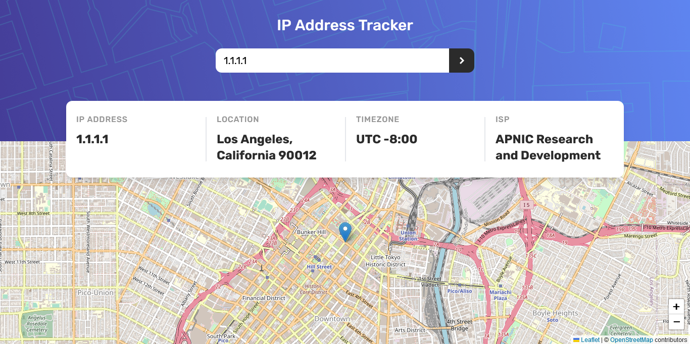

# Frontend Mentor - IP address tracker solution

This is a solution to the [IP address tracker challenge on Frontend Mentor](https://www.frontendmentor.io/challenges/ip-address-tracker-I8-0yYAH0). Frontend Mentor challenges help you improve your coding skills by building realistic projects. 

## Table of contents

- [Overview](#overview)
  - [The challenge](#the-challenge)
  - [Screenshot](#screenshot)
  - [Links](#links)
- [My process](#my-process)
  - [Built with](#built-with)
  - [What I learned](#what-i-learned)
  - [Continued development](#continued-development)
  - [Useful resources](#useful-resources)
- [Author](#author)

## Overview

### The challenge

Users should be able to:

- View the optimal layout for each page depending on their device's screen size
- See hover states for all interactive elements on the page
- See their own IP address on the map on the initial page load
- Search for any IP addresses or domains and see the key information and location

### Screenshot

### Links

- [Solution](https://github.com/arey-dev/ip-address-tracker)
- [Live Site](https://your-live-site-url.com)

## My process

### Built with
- [React](https://reactjs.org/) - JS library
- [Tailwind CSS](https://tailwindcss.com/) - For styles

### What I learned

In this project, I learned how to use Tailwind CSS. At first it was confusing because it's my first time utilizing it in a project. But as I go on with the project, I gradually appreciate the beauty of this CSS framework. 

Not only did I experience using tailwind css, but also the use of leaflet-js. It's a tool to create interactive maps to integrate with your app.

### Continued development

In my next projects, I want to focus on react-router and some advance concepts of react, like Redux and PropTypes. In addition to that, I also want to work on file structire of my react app.

### Useful resources

- [Tailwind CSS](https://tailwindcss.com/) - You can learn Tailwind CSS here.
- [React Leaflet](https://react-leaflet.js.org/) - Useful when using React.

## Author
- Frontend Mentor - [@arey-dev](https://www.frontendmentor.io/profile/arey-dev)
